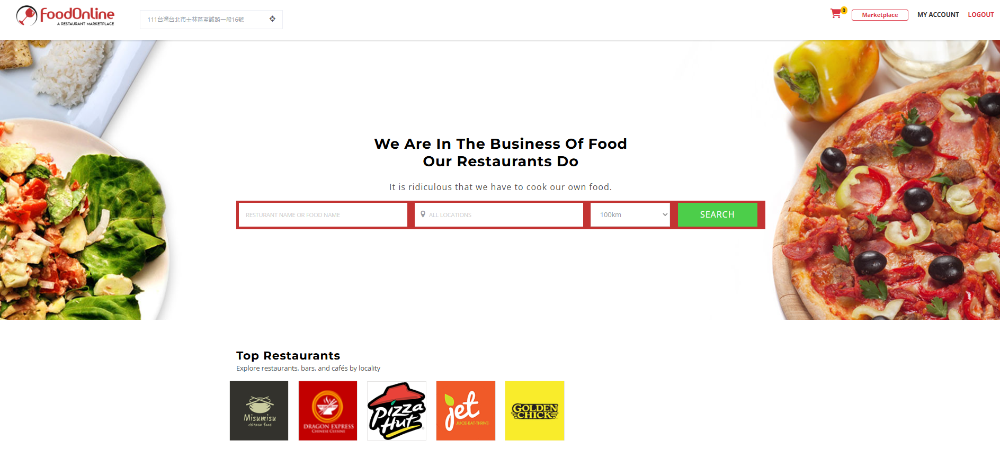
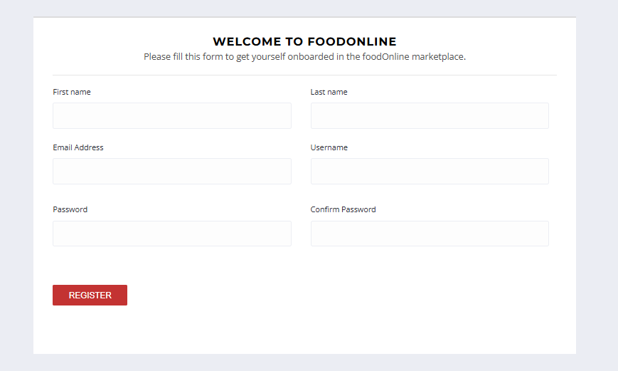
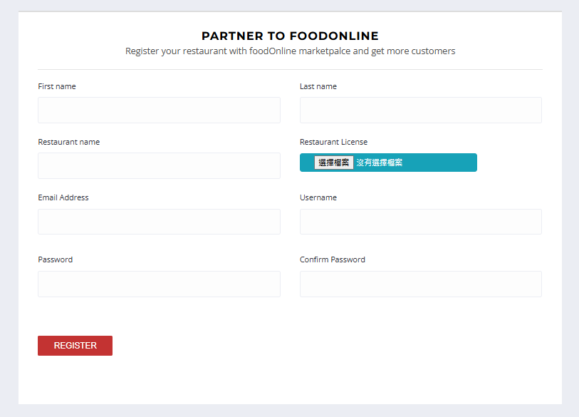
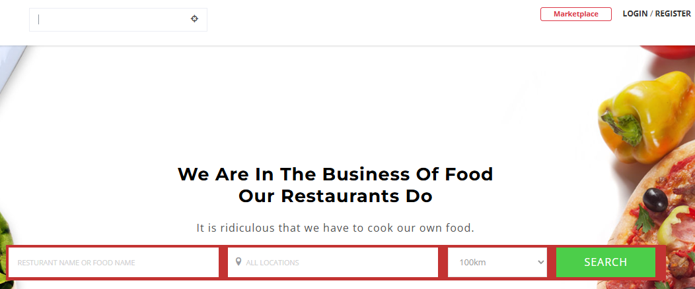
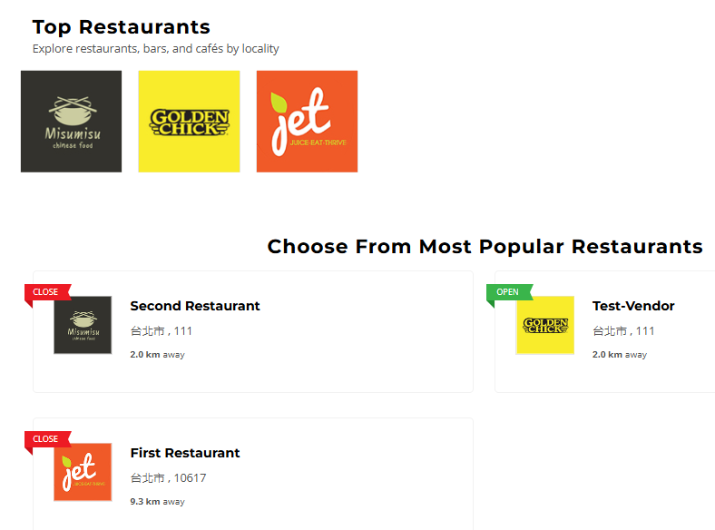
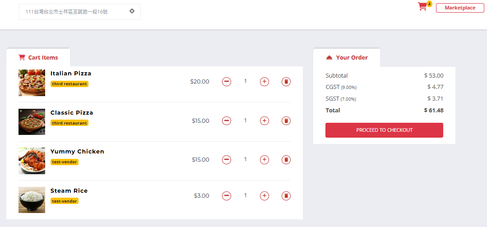
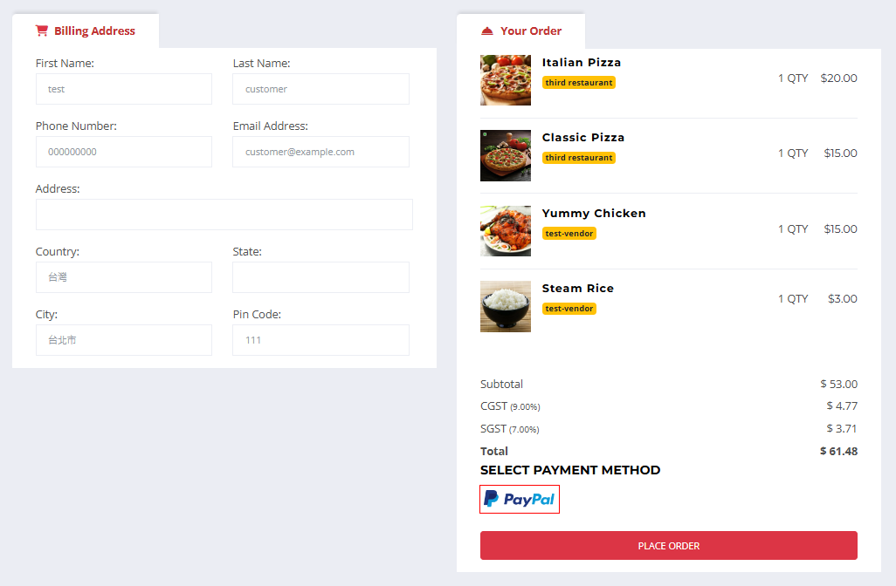
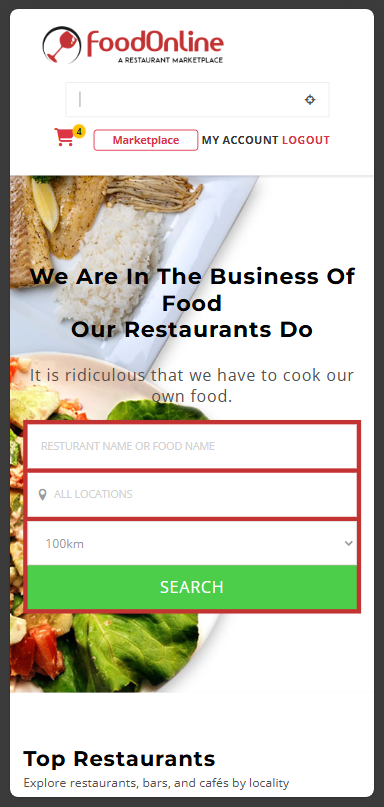

# Multi-Vendor Restaurant Marketplace

  

## Project Overview
This is a fully-featured multi-vendor restaurant marketplace website developed using Django, Bootstrap, and JavaScript. The project showcases complex functionalities including location-based search and nearby restaurant recommendations.

The location of Google Maps API is restricted to Taiwan only.

[Demo Website](https://linhung.online/)

Login as customer:
 - User : customer@example.com
 - Password : 0000

Login as vendor:
 - User : vendor@example.com
 - Password : 0000

## Tech Stack
- Backend: Django
- Frontend: HTML, CSS, JavaScript, Bootstrap
- Database: PostgreSQL
- APIs: Google Maps API, PayPal API

## Project Highlights
1. **Custom User Model**: Implemented a flexible user management system.

    You can register as a customer and order food from the restaurant. The website will send you a validation email to validate your account.

    

      
    

    You can also register as a vendor and provide food for the customer. The website will send you a validation email to validate your account. After you validate your account, you have to wait for the admin to approve your vendor license.

    

      
    

2. **Location Services**: Integrated Google Maps API, GDAL, PostGis for precise location-based functionalities.

    - Nearby restaurant search: When you enter your address and desired search radius, the website searches for registered restaurants near your location.

    - Automatic address suggestion: Utilizing Google Maps API, suggested address options appear as you type your address.

    - Distance calculation: When you input your current address, the system automatically calculates the distance between you and the restaurants.
    
    

      
    

     
    

      
    

3. **Real-time Interactions**: Utilized AJAX for refresh-free updates on cart and business hours.

    

      
    

4. **Payment Integration**: Supports payment method to enhance user experience.

    

      
    

5. **Responsive Design**: Ensures a seamless experience across various devices.

    

      
    

## Key Features
- User registration and authentication
- Vendor registration and approval system
- Restaurant profile management
- Menu builder (CRUD functionality for categories and food items)
- Shopping cart functionality (implemented with AJAX for refresh-free operation)
- Location-based search functionality
- Smart search capabilities
- Dynamic business hours module
- Dynamic tax module
- Order management system
- Payment gateway integration (PayPal)
- Responsive design for mobile devices

## Future Improvements
- Implement real-time chat functionality
- Add rating and review system
- Integrate additional payment gateways
- Develop a mobile app version

## Contact Information
If you have any questions or suggestions about this project, feel free to contact me:
- Email: linhung0319@gmail.com
- Portfolio: [My Portfolio](https://linhung0319.vercel.app/)
- Linkedin: [My Linkedin](https://www.linkedin.com/in/hung-lin/)
